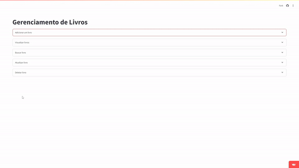

# Projeto CRUD com FastAPI, SQLAlchemy, Pydantic, PostgreSQL, Streamlit e Docker

<div align="center">
  
</div>

## Visão Geral

Este projeto tem como objetivo criar uma aplicação CRUD utilizando FastAPI para o backend, SQLAlchemy para a interação com o banco de dados PostgreSQL, Pydantic para validação de dados, Streamlit para a interface web e Docker para containerização. FastAPI é um framework moderno e de alta performance para construção de APIs, enquanto Streamlit facilita a criação de dashboards e aplicações web interativas. Docker garante que o ambiente de desenvolvimento seja consistente e facilita a implantação em diferentes ambientes.

## Passo a passo de instalação

### 1. Clonar o repositório

Para clonar o repositório, execute o seguinte comando no terminal:

```bash
git clone https://github.com/HerbertSouto/Read_Books.git
```
### 2. Navegar até o diretório do projeto

Entre no diretório do projeto:

```bash
cd Read_Books
```
### 3. Instalar as dependências com Poetry

Se você ainda não tem o Poetry instalado, siga as instruções na documentação oficial. Após a instalação, execute o seguinte comando para instalar as dependências do projeto:

```bash
poetry install
```

### 4. Subir o ambiente com Docker Compose

Após instalar as dependências, você pode subir o ambiente com Docker Compose. Execute o seguinte comando:

```bash
docker compose up
```
Isso iniciará os contêineres Docker definidos no arquivo docker-compose.yml.


## Ferramentas e Tecnologias

- **Python**: Linguagem de programação principal.
- **FastAPI**: Framework moderno e de alta performance para construção de APIs.
- **SQLAlchemy**: Biblioteca ORM (Object-Relational Mapping) para gerenciamento do banco de dados.
- **Pydantic**: Biblioteca para validação de dados.
- **PostgreSQL**: Banco de dados relacional robusto e escalável.
- **Uvicorn**: Servidor ASGI para rodar a aplicação FastAPI.
- **Streamlit**: Biblioteca para criação de interfaces web interativas.
- **Docker**: Plataforma de containerização para criar, implantar e rodar aplicações em containers.
- **Poetry**: Ferramenta para gerenciamento de dependências e empacotamento no Python.